# Installing WordPress on Amazon Linux 2023

> WordPress is the world's most popular Content Management System (CMS), powering approximately 43% of all websites on the internet.

## Table of Contents

- [Prerequisites](#prerequisites)
- [Architecture Overview](#architecture-overview)
- [Step-by-Step Guide](#step-by-step-guide)
  - [1. Create WordPress Database and User](#1-create-wordpress-database-and-user)
  - [2. Download WordPress](#2-download-wordpress)
  - [3. Configure Document Root and Permissions](#3-configure-document-root-and-permissions)
  - [4. Install Required PHP Extensions](#4-install-required-php-extensions)
  - [5. Complete Web Installation](#5-complete-web-installation)
- [Troubleshooting](#troubleshooting)
- [⛔ Reset Instructions (Danger Zone)](#-reset-instructions-danger-zone)

---

## Prerequisites

Before starting this guide, ensure you have the following in place:

- An Amazon Linux 2023 EC2 instance running and accessible via SSH
- Basic familiarity with Linux terminal commands
- A LAMP stack installed and running

Run the following command to verify your LAMP stack and check all version numbers before proceeding:

```bash
curl -sL https://raw.githubusercontent.com/danielcregg/dc-labs/main/website-labs/check-lamp.sh | bash
```

**Expected output when your LAMP stack is correctly installed:**

```
  ╔═════════════════════════════════════════════╗
  ║          LAMP STACK  VERIFICATION           ║
  ╠═════════════════════════════════════════════╣
  ║                                             ║
  ║   [OS]  Linux  (Amazon Linux 2023)          ║
  ║         └─ Foundation layer                 ║
  ║                                             ║
  ╠═════════════════════════════════════════════╣
  ║   [OK]  Apache HTTP Server                  ║
  ║         Version : 2.4.58                    ║
  ║         Port    : 80 / 443                  ║
  ║                                             ║
  ║   [OK]  PHP                                 ║
  ║         Version : 8.2.13                    ║
  ║         Role    : Application layer         ║
  ║                                             ║
  ║   [OK]  MariaDB  (MySQL compatible)         ║
  ║         Version : 10.5.22-MariaDB           ║
  ║         Port    : 3306                      ║
  ║                                             ║
  ╠═════════════════════════════════════════════╣
  ║                                             ║
  ║   [OK]  All components detected             ║
  ║   [OK]  LAMP stack is ready                 ║
  ║                                             ║
  ║   --> You are ready to install WordPress!   ║
  ║                                             ║
  ╚═════════════════════════════════════════════╝
```

**If a component is missing, you will see `[!!]` next to it instead:**

```
  ║   [!!]  PHP                                 ║
  ║         Version : NOT FOUND                 ║
  ...
  ║   [!!]  One or more components not found    ║
  ║   [!!]  Please install the LAMP stack first ║
  ║                                             ║
  ║   --> Do NOT proceed until all show [OK]    ║
```

> 📝 **Note**: Amazon Linux 2023 ships with **MariaDB**, which is a fully MySQL-compatible drop-in replacement. You will see references to both `mysql` (the client command) and `mariadb` (the service name) throughout this guide — they refer to the same underlying system.

### Upgrade to Latest Versions

The default LAMP stack on Amazon Linux 2023 may not ship with the latest PHP and MariaDB versions. Run the following command to automatically detect and upgrade to the latest versions available in the dnf repositories:

```bash
curl -sL https://raw.githubusercontent.com/danielcregg/dc-labs/main/website-labs/update-lamp-stack.sh | bash
```

**Expected output after a successful upgrade:**

```
  ╔═════════════════════════════════════════════╗
  ║        LAMP STACK  UPGRADE  COMPLETE        ║
  ╠═════════════════════════════════════════════╣
  ║                                             ║
  ║   PHP      : x.x.x                         ║
  ║   MariaDB  : xx.xx.x                       ║
  ║                                             ║
  ╠═════════════════════════════════════════════╣
  ║                                             ║
  ║   [OK]  All components upgraded             ║
  ║   [OK]  LAMP stack is ready for WordPress   ║
  ║                                             ║
  ╚═════════════════════════════════════════════╝
```

> 📝 The script automatically detects the latest available versions. If your versions are already up to date, it will skip the upgrade and report that everything is current. The script also installs all PHP extensions required by WordPress.

---

## Architecture Overview

Before diving in, it helps to understand how the components fit together. WordPress does not run in isolation — it sits on top of a LAMP stack, with each layer playing a specific role.

### How a WordPress Request is Handled

When a visitor loads your WordPress site, the request flows through several layers before a page is returned:


### LAMP Stack Component Roles

```mermaid
graph TD
    A[🌐 Web Browser] -->|HTTP Request| B

    subgraph EC2["☁️ Amazon Linux 2023 EC2 Instance"]
        B[Apache httpd\nWeb Server\nPort 80/443]
        C[PHP\nServer-side\nLanguage]
        D[WordPress\nApplication Files\n/var/www/html/]
        E[MariaDB\nDatabase Server\nPort 3306]
        F[(wordpress\nDatabase)]

        B -->|Passes .php files to| C
        C -->|Executes| D
        D -->|Queries via php-mysqli| E
        E -->|Reads & writes| F
    end

    B -.->|Serves static files\ndirectly| A
```



## Step-by-Step Guide

### 1. Create WordPress Database and User

First, we'll create a dedicated database and user for WordPress. Log in to MariaDB as root:

```bash
sudo mysql
```

Inside the MariaDB prompt, execute these commands:

```sql
-- View existing databases
SHOW DATABASES;

-- Create a new database for WordPress
CREATE DATABASE wordpress;

-- Create a dedicated user for WordPress
-- ⚠️ Replace 'password' with a strong, unique password in any real deployment
CREATE USER 'wordpressuser'@'localhost' IDENTIFIED BY 'password';

-- Grant the user full privileges on the WordPress database only
GRANT ALL PRIVILEGES ON wordpress.* TO 'wordpressuser'@'localhost';

-- Apply the privilege changes immediately
FLUSH PRIVILEGES;

-- Exit MariaDB
exit;
```

> `FLUSH PRIVILEGES` applies permission changes immediately — no service restart is required.

The diagram below shows the database structure that WordPress will create automatically during the web installation in Step 5:


---

### 2. Download WordPress

Download the latest version of WordPress to your home directory:

```bash
# Download WordPress
wget -P /home/$USER/ https://wordpress.org/latest.tar.gz
```

```bash
# Extract the archive
tar zxvf /home/$USER/latest.tar.gz -C /home/$USER/
```

```bash
# Remove the downloaded archive to keep things tidy
rm /home/$USER/latest.tar.gz
```

---

### 3. Configure Document Root and Permissions

Copy the WordPress files to the Apache document root and set the correct ownership:

```bash
# Copy WordPress files to the Apache document root
sudo cp -rf /home/$USER/wordpress/* /var/www/html/
```

```bash
# Set ownership to the Apache web server user (recursive — covers all files and hidden files)
sudo chown -R apache:apache /var/www/html/
```

> ⚠️ **Note**: Amazon Linux 2023 uses `apache` as the web server user, not `www-data` as used on Ubuntu/Debian systems.

The diagram below shows the resulting file structure under `/var/www/html/` after copying:

```mermaid
graph TD
    ROOT["/var/www/html/\nowner: apache:apache"]

    ROOT --> WC[wp-content/]
    ROOT --> WI[wp-includes/]
    ROOT --> WA[wp-admin/]
    ROOT --> IDX[index.php]
    ROOT --> HTX[.htaccess ⚠️]

    WC --> THM[themes/]
    WC --> PLG[plugins/]
    WC --> UPL[uploads/]

    style ROOT fill:#238636,color:#fff,stroke:none
    style HTX fill:#9e6a03,color:#fff,stroke:none
```



> 📝 The file marked ⚠️ (`.htaccess`) controls server-level access rules — protect it carefully in production. Note that `wp-config.php` does not exist yet at this stage; it will be generated automatically by the web installer in Step 5.

---

### 4. Install Required PHP Extensions

WordPress depends on several PHP extensions. If you ran the upgrade script in the prerequisites, these were already installed. Run the command below to confirm they are all present. Replace `X.X` with your installed PHP version (e.g. `8.3`, `8.4`):

```bash
# Check your PHP version first
php -v | head -n1
```

```bash
# Install extensions (replace X.X with your version, e.g. 8.3)
sudo dnf install phpX.X-mysqli phpX.X-mysqlnd phpX.X-gd phpX.X-curl phpX.X-xml phpX.X-mbstring phpX.X-zip phpX.X-intl -y
```

The table below explains what each extension does and whether it is required or recommended:

| Extension | Purpose | Required? |
|-----------|---------|-----------|
| `mysqli` / `mysqlnd` | Database connectivity to MariaDB | ✅ Required |
| `gd` | Image resizing and thumbnail generation | ✅ Required |
| `curl` | External HTTP requests (updates, APIs) | ✅ Required |
| `xml` | XML parsing for feeds and plugins | ✅ Required |
| `mbstring` | Multi-byte string handling for non-Latin text | ✅ Required |
| `zip` | Installing/updating plugins and themes | ✅ Required |
| `intl` | Internationalisation support | ⭐ Recommended |

> 📝 **Note**: `json` is built into PHP 8.x and does not need a separate package. `imagick` may require the EPEL repository on Amazon Linux 2023 — WordPress will automatically fall back to `gd` for image processing if it is not available.

```bash
# Restart Apache to load all newly installed extensions
sudo systemctl restart httpd
```

---

### 5. Complete Web Installation

First, find your instance's public IP address:

```bash
curl -s ifconfig.me
```

Now complete the installation through your web browser:

1. **Navigate to your server's IP address** in a web browser

2. **Select your language**

   

3. **Prepare for installation** — click **"Let's go!"**

4. **Enter your database information**

   | Field | Value |
   |-------|-------|
   | Database Name | `wordpress` |
   | Username | `wordpressuser` |
   | Password | *(the password you set in Step 1)* |
   | Database Host | `localhost` |
   | Table Prefix | `wp_` (default) |

5. **Run the installation** — click **"Submit"** then **"Run the installation"**

   > 📝 **Note**: When you click "Submit", WordPress automatically creates a `wp-config.php` file in `/var/www/html/` containing your database credentials and connection settings.

6. **Set up your site**

   | Field | Value |
   |-------|-------|
   | Site Title | *Your choice* |
   | Username | `admin` |
   | Password | *Choose a strong password* |
   | Email | *Your email address* |

   Click **"Install WordPress"**

7. **Log in** using your new admin credentials — you're done! 🎉

### Verify Your Installation

After logging in, confirm everything is working:

- **Homepage**: Navigate to `http://<your-ip>/` — you should see your site with the default WordPress theme
- **Admin Dashboard**: Navigate to `http://<your-ip>/wp-admin/` — you should see the WordPress admin panel with the "Welcome to WordPress" message

---

## Troubleshooting

Use the decision tree below to quickly identify and resolve the most common issues:

```mermaid
flowchart TD
    A([❌ Problem]) --> B{What are\nyou seeing?}

    B -->|White screen / PHP error| C[Check PHP extensions\ndnf install php-mysqli php-gd\nsystemctl restart httpd]
    B -->|Permission denied| D[Fix ownership & permissions\nchown -R apache:apache /var/www/html\nchmod -R 755 /var/www/html]
    B -->|Error establishing\na database connection| E{Is MariaDB\nrunning?}

    E -->|No| F[Start MariaDB\nsystemctl start mariadb]
    E -->|Yes| G{Are credentials\ncorrect?}

    G -->|No| H[Re-check wp-config.php\nor re-run the web installer]
    G -->|Yes| I[Check user grants\nSHOW GRANTS FOR\nwordpressuser@localhost]

    C --> Z([✅ Resolved])
    D --> Z
    F --> Z
    H --> Z
    I --> Z

    style A fill:#da3633,color:#fff,stroke:none
    style Z fill:#238636,color:#fff,stroke:none
```



### Permission Issues

If you encounter permission errors in the browser:

```bash
sudo chmod -R 755 /var/www/html/
sudo chown -R apache:apache /var/www/html/
```

### Database Connection Issues

If WordPress cannot connect to the database:

**1. Verify MariaDB is running:**

```bash
sudo systemctl status mariadb
```

**2. Test the user credentials directly:**

```bash
sudo mysql -u wordpressuser -p -D wordpress
```

**3. Check that the user has the correct permissions:**

```bash
sudo mysql -e "SHOW GRANTS FOR 'wordpressuser'@'localhost';"
```

---

## ⛔ Reset Instructions (Danger Zone)

> **🔴 STOP — Only use these commands if you need to completely wipe your WordPress installation and start over. These actions are irreversible.**

<details>
<summary>🔽 Click here to reveal reset commands</summary>

To wipe everything and start fresh, run each command below in order:

```bash
# Remove WordPress source files from your home directory
rm -rf ~/wordpress
```

```bash
# Remove the downloaded archive (if it still exists)
rm -f ~/latest.tar.gz
```

```bash
# Clear the Apache document root
sudo rm -rf /var/www/html/*
```

```bash
# Drop the WordPress database and user
sudo mysql -u root -e "DROP DATABASE IF EXISTS wordpress; DROP USER IF EXISTS 'wordpressuser'@'localhost'; FLUSH PRIVILEGES;"
```

```bash
# Restart Apache to apply the clean state
sudo systemctl restart httpd
```

</details>

---
