# Installing WordPress on Amazon Linux 2023

> WordPress is the world's most popular Content Management System (CMS), powering approximately 43% of all websites on the internet.

## Table of Contents

- [Prerequisites](#prerequisites)
- [Architecture Overview](#architecture-overview)
- [Step-by-Step Guide](#step-by-step-guide)
  - [1. Create WordPress Database and User](#1-create-wordpress-database-and-user)
  - [2. Download WordPress](#2-download-wordpress)
  - [3. Configure Document Root and Permissions](#3-configure-document-root-and-permissions)
  - [4. Install Required PHP Extensions](#4-install-required-php-extensions)
  - [5. Complete Web Installation](#5-complete-web-installation)
- [Troubleshooting](#troubleshooting)
- [Reset Instructions](#reset-instructions)

---

## Prerequisites

Before starting this guide, ensure you have the following in place:

- An Amazon Linux 2023 EC2 instance running and accessible via SSH
- Basic familiarity with Linux terminal commands
- A LAMP stack installed and running

Run the following command to verify your LAMP stack and check all version numbers before proceeding:

```bash
curl -sL https://raw.githubusercontent.com/danielcregg/dc-labs/main/website-labs/check-lamp.sh | bash
```

**Expected output when your LAMP stack is correctly installed:**

```
  ╔═════════════════════════════════════════════╗
  ║          LAMP STACK  VERIFICATION           ║
  ╠═════════════════════════════════════════════╣
  ║                                             ║
  ║   [OS]  Linux  (Amazon Linux 2023)          ║
  ║         └─ Foundation layer                 ║
  ║                                             ║
  ╠═════════════════════════════════════════════╣
  ║   [OK]  Apache HTTP Server                  ║
  ║         Version : 2.4.58                    ║
  ║         Port    : 80 / 443                  ║
  ║                                             ║
  ║   [OK]  PHP                                 ║
  ║         Version : 8.2.13                    ║
  ║         Role    : Application layer         ║
  ║                                             ║
  ║   [OK]  MariaDB  (MySQL compatible)         ║
  ║         Version : 10.5.22-MariaDB           ║
  ║         Port    : 3306                      ║
  ║                                             ║
  ╠═════════════════════════════════════════════╣
  ║                                             ║
  ║   [OK]  All components detected             ║
  ║   [OK]  LAMP stack is ready                 ║
  ║                                             ║
  ║   --> You are ready to install WordPress!   ║
  ║                                             ║
  ╚═════════════════════════════════════════════╝
```

**If a component is missing, you will see `[!!]` next to it instead:**

```
  ║   [!!]  PHP                                 ║
  ║         Version : NOT FOUND                 ║
  ...
  ║   [!!]  One or more components not found    ║
  ║   [!!]  Please install the LAMP stack first ║
  ║                                             ║
  ║   --> Do NOT proceed until all show [OK]    ║
```

> 📝 **Note**: Amazon Linux 2023 ships with **MariaDB**, which is a fully MySQL-compatible drop-in replacement. You will see references to both `mysql` (the client command) and `mariadb` (the service name) throughout this guide — they refer to the same underlying system.

---

## Architecture Overview

Before diving in, it helps to understand how the components fit together. WordPress does not run in isolation — it sits on top of a LAMP stack, with each layer playing a specific role.

### How a WordPress Request is Handled

When a visitor loads your WordPress site, the request flows through several layers before a page is returned:


### LAMP Stack Component Roles

```mermaid
graph TD
    A[🌐 Web Browser] -->|HTTP Request| B

    subgraph EC2["☁️ Amazon Linux 2023 EC2 Instance"]
        B[Apache httpd\nWeb Server\nPort 80/443]
        C[PHP\nServer-side\nLanguage]
        D[WordPress\nApplication Files\n/var/www/html/]
        E[MariaDB\nDatabase Server\nPort 3306]
        F[(wordpress\nDatabase)]

        B -->|Passes .php files to| C
        C -->|Executes| D
        D -->|Queries via php-mysqli| E
        E -->|Reads & writes| F
    end

    B -.->|Serves static files\ndirectly| A
```



### Installation Process Overview

This is the sequence of steps you will follow in this guide:

```mermaid
flowchart TD
    A([▶ Start]) --> B

    B[1️⃣ Create Database & User\nCreate wordpress DB\nCreate wordpressuser]
    B --> C[2️⃣ Download WordPress\nwget latest.tar.gz\nExtract to home dir]
    C --> D[3️⃣ Configure Permissions\nCopy files to /var/www/html\nchown apache:apache]
    D --> E[4️⃣ Install PHP Extensions\ndnf install php-mysqli\nphp-gd php-curl etc.]
    E --> F[5️⃣ Web Installer\nOpen browser\nEnter DB credentials\nSet site title & admin]
    F --> G([✅ WordPress Running])

    style A fill:#238636,color:#fff,stroke:none
    style G fill:#238636,color:#fff,stroke:none
    style B fill:#1c2128,color:#e6edf3,stroke:#30363d
    style C fill:#1c2128,color:#e6edf3,stroke:#30363d
    style D fill:#1c2128,color:#e6edf3,stroke:#30363d
    style E fill:#1c2128,color:#e6edf3,stroke:#30363d
    style F fill:#1c2128,color:#e6edf3,stroke:#30363d
```



---

## Step-by-Step Guide

### 1. Create WordPress Database and User

First, we'll create a dedicated database and user for WordPress. Log in to MariaDB as root:

```bash
sudo mysql
```

Inside the MariaDB prompt, execute these commands:

```sql
-- View existing databases
SHOW DATABASES;

-- Create a new database for WordPress
CREATE DATABASE wordpress;

-- Create a dedicated user for WordPress
-- ⚠️ Replace 'password' with a strong, unique password in any real deployment
CREATE USER 'wordpressuser'@'localhost' IDENTIFIED BY 'password';

-- Grant the user full privileges on the WordPress database only
GRANT ALL PRIVILEGES ON wordpress.* TO 'wordpressuser'@'localhost';

-- Apply the privilege changes immediately
FLUSH PRIVILEGES;

-- Exit MariaDB
exit;
```

> `FLUSH PRIVILEGES` applies permission changes immediately — no service restart is required.

The diagram below shows the database structure that WordPress will create automatically during the web installation in Step 5:


---

### 2. Download WordPress

Download the latest version of WordPress to your home directory:

```bash
# Download WordPress
sudo wget -P /home/$USER/ https://wordpress.org/latest.tar.gz
```

```bash
# Extract the archive
sudo tar zxvf /home/$USER/latest.tar.gz -C /home/$USER/
```

```bash
# Remove the downloaded archive to keep things tidy
sudo rm /home/$USER/latest.tar.gz
```

---

### 3. Configure Document Root and Permissions

Copy the WordPress files to the Apache document root and set the correct ownership:

```bash
# Copy WordPress files to the Apache document root
sudo cp -rf /home/$USER/wordpress/* /var/www/html/
```

```bash
# Set ownership to the Apache web server user (recursive — covers all files and hidden files)
sudo chown -R apache:apache /var/www/html/
```

> ⚠️ **Note**: Amazon Linux 2023 uses `apache` as the web server user, not `www-data` as used on Ubuntu/Debian systems.

The diagram below shows the resulting file structure under `/var/www/html/` after copying:

```mermaid
graph TD
    ROOT["/var/www/html/\nowner: apache:apache"]

    ROOT --> WC[wp-content/]
    ROOT --> WI[wp-includes/]
    ROOT --> WA[wp-admin/]
    ROOT --> IDX[index.php]
    ROOT --> CFG[wp-config.php ⚠️]
    ROOT --> HTX[.htaccess ⚠️]

    WC --> THM[themes/]
    WC --> PLG[plugins/]
    WC --> UPL[uploads/]

    style ROOT fill:#238636,color:#fff,stroke:none
    style CFG fill:#9e6a03,color:#fff,stroke:none
    style HTX fill:#9e6a03,color:#fff,stroke:none
```



> 📝 Files marked ⚠️ are the most security-sensitive in your installation. `wp-config.php` contains your database credentials, and `.htaccess` controls server-level access rules. Protect both carefully in production.

---

### 4. Install Required PHP Extensions

WordPress depends on several PHP extensions. Install them all in one command:

```bash
sudo dnf install php-mysqli php-mysqlnd php-gd php-curl php-xml php-mbstring php-zip php-intl php-json php-imagick -y
```

The table below explains what each extension does and whether it is required or recommended:

| Extension | Purpose | Required? |
|-----------|---------|-----------|
| `php-mysqli` / `php-mysqlnd` | Database connectivity to MariaDB | ✅ Required |
| `php-gd` | Image resizing and thumbnail generation | ✅ Required |
| `php-curl` | External HTTP requests (updates, APIs) | ✅ Required |
| `php-xml` | XML parsing for feeds and plugins | ✅ Required |
| `php-mbstring` | Multi-byte string handling for non-Latin text | ✅ Required |
| `php-zip` | Installing/updating plugins and themes | ✅ Required |
| `php-intl` | Internationalisation support | ⭐ Recommended |
| `php-json` | JSON parsing | ⭐ Recommended |
| `php-imagick` | Advanced image processing (superior to GD) | ⭐ Recommended |

> 📝 **Note**: `php-imagick` may require the EPEL repository on Amazon Linux 2023. If the package is not found, you can omit it — WordPress will automatically fall back to the `php-gd` library for image processing.

```bash
# Restart Apache to load all newly installed extensions
sudo systemctl restart httpd
```

---

### 5. Complete Web Installation

First, find your instance's public IP address:

```bash
curl -s ifconfig.me
```

Now complete the installation through your web browser:

1. **Navigate to your server's IP address** in a web browser

2. **Select your language**

   

3. **Prepare for installation** — click **"Let's go!"**

4. **Enter your database information**

   | Field | Value |
   |-------|-------|
   | Database Name | `wordpress` |
   | Username | `wordpressuser` |
   | Password | *(the password you set in Step 1)* |
   | Database Host | `localhost` |
   | Table Prefix | `wp_` (default) |

5. **Run the installation** — click **"Submit"** then **"Run the installation"**

6. **Set up your site**

   | Field | Value |
   |-------|-------|
   | Site Title | *Your choice* |
   | Username | `admin` |
   | Password | *Choose a strong password* |
   | Email | *Your email address* |

   Click **"Install WordPress"**

7. **Log in** using your new admin credentials — you're done! 🎉

---

## Troubleshooting

Use the decision tree below to quickly identify and resolve the most common issues:

```mermaid
flowchart TD
    A([❌ Problem]) --> B{What are\nyou seeing?}

    B -->|White screen / PHP error| C[Check PHP extensions\ndnf install php-mysqli php-gd\nsystemctl restart httpd]
    B -->|Permission denied| D[Fix ownership & permissions\nchown -R apache:apache /var/www/html\nchmod -R 755 /var/www/html]
    B -->|Error establishing\na database connection| E{Is MariaDB\nrunning?}

    E -->|No| F[Start MariaDB\nsystemctl start mariadb]
    E -->|Yes| G{Are credentials\ncorrect?}

    G -->|No| H[Re-check wp-config.php\nor re-run the web installer]
    G -->|Yes| I[Check user grants\nSHOW GRANTS FOR\nwordpressuser@localhost]

    C --> Z([✅ Resolved])
    D --> Z
    F --> Z
    H --> Z
    I --> Z

    style A fill:#da3633,color:#fff,stroke:none
    style Z fill:#238636,color:#fff,stroke:none
```



### Permission Issues

If you encounter permission errors in the browser:

```bash
sudo chmod -R 755 /var/www/html/
sudo chown -R apache:apache /var/www/html/
```

### Database Connection Issues

If WordPress cannot connect to the database:

**1. Verify MariaDB is running:**

```bash
sudo systemctl status mariadb
```

**2. Test the user credentials directly:**

```bash
sudo mysql -u wordpressuser -p -D wordpress
```

**3. Check that the user has the correct permissions:**

```bash
sudo mysql -e "SHOW GRANTS FOR 'wordpressuser'@'localhost';"
```

---

## Reset Instructions

To wipe everything and start fresh, run:

```bash
sudo rm -rf ~/wordpress && \
sudo rm -f ~/latest.tar.gz && \
sudo rm -rf /var/www/html/* && \
sudo mysql -u root -e "DROP DATABASE IF EXISTS wordpress; DROP USER IF EXISTS 'wordpressuser'@'localhost'; FLUSH PRIVILEGES;" && \
sudo systemctl restart httpd
```

> ⚠️ **Warning**: This will permanently delete the WordPress files from your home directory and all content from your web root (`/var/www/html/`). Use with caution and ensure you have backups if needed.

---

*This guide was prepared for educational purposes as part of AWS cloud services training.*
